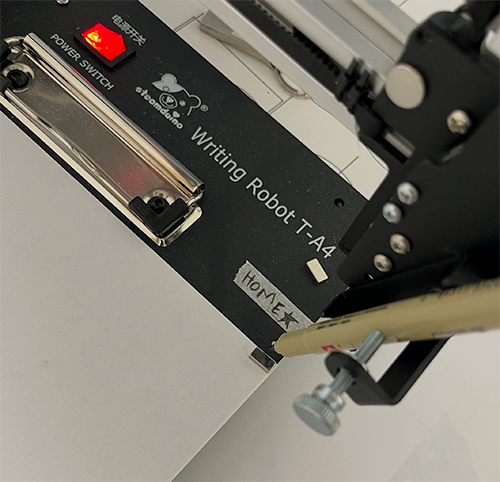

# p5-plotter-control
## a real-time pen plotter control library for p5.js

This is a p5.js library that allows for real-time control of GRBL-controllable pen plotters like those manufactured by iDraw / uunatek. With this library, you can control the pen plotter using p5.js-style shape functions. It is ideal for applications where you want to achieve direct, live control of the pen plotter, instead of plotting a finished file all at once as you might with other p5 libraries like [p5.plotSVG](https://github.com/golanlevin/p5.plotSvg). Please see the separate SVGtoiDraw.md document for details on the workflow for exporting vector files for plotting from Inkscape to iDraw plotters.

This library uses the [WebSerial](https://developer.chrome.com/docs/capabilities/serial) implementation to control the pen plotter directly from the browser. Currently, WebSerial only works in Chrome/Chromium based browsers. A node.js relay based version is available in a separate branch, which may be useful if you need to run this on a non-Chromium browser.

The library consists of three components:

- the GPlotter class (in gplotter.js), which translates p5.js shape functions into G-code and facilitates serial communication with the plotter
- The p5.js sketch (mySketch.js), which can be edited to generate graphics to be rendered by the plotter
- index.html, which embeds gplotter.js and mySketch.js – open this file in the browser (and not, for instance, the Visual Studio code preview pane) to run your project

## Plotter Configuration

Before connecting, position the pen carriage in the "top right" corner of the page – the same corner used by the iDraw Inkscape plugin. Connecting to the plotter (see the Connect button, below) automatically sets this position as the machine's zero point – there's no separate zeroing step.



## Class Initialization

To use the library, create an instance of the GPlotter class. Make sure that the first two arguments – plotter page width and height – conform to the actual plotter hardware you have:

- A4: 210mm x 297mm
- A3: 297mm x 420mm
- A2: 420mm x 594mm
- A1: 594mm x 841mm
- A0: 841mm x 1189mm

After initializing the plotter object, you can use plotter.screenWidth and plotter.canvasHeight to create the p5.js canvas, which will be proportionate to your respective paper size.


```javascript
let plotter;

function setup() {
  plotter = new GPlotter(210,297,500); 
  createCanvas(plotter.screenWidth, plotter.canvasHeight);
}
```

### GPlotter Parameters
- `pageWidth` (Number): Width of the plotting area in millimeters (e.g., 594).
- `pageHeight` (Number): Height of the plotting area in millimeters (e.g., 841).
- `screenWidth` (Number): Width of the canvas display in pixels (e.g., 500).
- `enabled` (Boolean): Whether plotting is initially enabled (e.g., `false`). (optional)

---

## Creating a p5.js sketch with live plotter control

You can control the pen plotter using the GPlotter shape functions listed below. Standard p5.js shape functions – such as circle, rectangle, line, arc, etc – have equivalents within the gplotter class, which simultaneously draw the forms to the on-screen canvas, while generating and sending equivalent messages to the plotter.

**Don't call plotter shape functions unconditionally inside `draw()`.** Since `draw()` runs every frame, an unguarded call fires dozens of times per second. It's fine to call them from within `draw()` as long as the call is gated by discrete, one-shot logic (a timer, a flag, an event check) that lets it through exactly once, not on every frame. Event handler functions like `mousePressed()` and `keyPressed()` are discrete by nature — they only fire once per event, not continuously — which makes them natural places to call shape functions directly, no extra guard needed. Please see the included examples for demonstrations of these kinds of discrete events.

---

## Display Method

### `plotter.display()`
Displays all drawn shapes on the on-screen canvas using `p5.js` drawing functions. This is the only function that should run repeatedly within `draw()`, as its sole function is to display the drawn shapes in the browser, not to control the plotter.

---

## Shape Functions

Here is a list of all the draw functions available in the GPlotter class that users can call to create shapes. Each function adds a shape to the `drawnShapes` array and optionally generates G-code if plotting is enabled.

## 1. `plotter.circle(x, y, d, fill)`

Draws a circle at a specified position with a given diameter.

**Parameters:**
- `x` (Number): X-coordinate of the circle's center.
- `y` (Number): Y-coordinate of the circle's center.
- `d` (Number): Diameter of the circle.
- `fill` (Boolean, optional): Whether to fill the circle. Default is false.

## 2. `plotter.rectangle(x, y, w, h, fill)`

Draws a rectangle at a specified position with a given width and height.

**Parameters:**
- `x` (Number): X-coordinate of the rectangle's top-left corner.
- `y` (Number): Y-coordinate of the rectangle's top-left corner.
- `w` (Number): Width of the rectangle.
- `h` (Number): Height of the rectangle.
- `fill` (Boolean, optional): Whether to fill the rectangle. Default is false.

## 3. `plotter.arc(x, y, w, h, start, stop)`

Draws an arc with specified dimensions and angles.

**Parameters:**
- `x` (Number): X-coordinate of the arc's center.
- `y` (Number): Y-coordinate of the arc's center.
- `w` (Number): Width of the arc (horizontal diameter).
- `h` (Number): Height of the arc (vertical diameter).
- `start` (Number): Starting angle in radians.
- `stop` (Number): Stopping angle in radians.

## 4. `plotter.line(x1, y1, x2, y2)`

Draws a straight line between two points.

**Parameters:**
- `x1` (Number): X-coordinate of the starting point.
- `y1` (Number): Y-coordinate of the starting point.
- `x2` (Number): X-coordinate of the ending point.
- `y2` (Number): Y-coordinate of the ending point.

## 5. `plotter.ellipse(x, y, w, h, fill)`

Draws an ellipse at a specified position with given width and height.

**Parameters:**
- `x` (Number): X-coordinate of the ellipse's center.
- `y` (Number): Y-coordinate of the ellipse's center.
- `w` (Number): Width of the ellipse (horizontal diameter).
- `h` (Number): Height of the ellipse (vertical diameter).
- `fill` (Boolean, optional): Whether to fill the ellipse. Default is false.

## 6. `plotter.point(x, y)`

Draws a single point at a specified position.

**Parameters:**
- `x` (Number): X-coordinate of the point.
- `y` (Number): Y-coordinate of the point.

## 7. Custom Shape Functions

To create custom shapes, use the following sequence of functions:

### `plotter.beginShape()`
Starts recording vertices for a custom shape.

### `plotter.vertex(x, y)`
Adds a straight-line vertex to the custom shape.

### `plotter.curveVertex(x, y)`
Adds a curve vertex to the custom shape (for smooth curves).

### `plotter.endShape(close, fill)`
Finishes recording the custom shape and optionally closes and fills it.

**Parameters:**
- `close` (Boolean, optional): Whether to close the shape. Default is false.
- `fill` (Boolean, optional): Whether to fill the shape. Default is false.

## 8. `plotter.drawString(text, x, y, scale)`

Draws a string of vector text using a built-in Hershey-style font ("futural"), starting at the given position. Uses [Hershey Text functions by Allison Parrish](https://editor.p5js.org/allison.parrish/sketches/SJv2DCYpQ) as implemented by [Golan Levin](https://github.com/golanlevin/p5-single-line-font-resources/blob/main/Hershey/Hershey_inline_font/sketch.js)

**Parameters:**
- `text` (`String`): The text content to draw (e.g., `"Hello World!"`).
- `x` (`Number`): X-coordinate of the start of the text (left baseline).
- `y` (`Number`): Y-coordinate of the text's baseline.
- `scale` (`Number`): Multiplier to scale the text size (e.g., `0.5` for half size).

**Example:**

```js
plotter.drawString("Hello Plotter!", 50, 200, 0.5);
```

## 9. Free Draw Functions

Draws a continuous, arbitrary-length stroke by feeding a start point, a stream of points, and an end call – useful for click-and-drag or mouse-tracked drawing, where the full path isn't known in advance. Unlike the other shape functions, the pen stays down between calls, so the whole path is drawn as one continuous line rather than separate segments. If the path goes outside the plottable area (defined by the margins), the pen automatically lifts, and lowers again if the path re-enters.

### `plotter.startFreeDraw(x, y)`
Lowers the pen at `(x, y)` and begins a new free-draw stroke.

### `plotter.freeDrawTo(x, y)`
Draws a continuous line segment from the last free-draw point to `(x, y)`. Has no effect if `startFreeDraw()` hasn't been called (or if `endFreeDraw()` already ended the stroke).

### `plotter.endFreeDraw()`
Ends the current free-draw stroke and lifts the pen.

**Example:**

```js
function mousePressed() {
  plotter.startFreeDraw(mouseX, mouseY);
}

function mouseDragged() {
  plotter.freeDrawTo(mouseX, mouseY);
}

function mouseReleased() {
  plotter.endFreeDraw();
}
```

---

## Example Usage

```javascript
// Draw a filled circle
plotter.circle(100, 100, 50, true);

// Draw a rectangle without fill
plotter.rectangle(150, 150, 80, 60, false);

// Draw an arc
plotter.arc(200, 200, 100, 100, 0, PI);

// Draw a line
plotter.line(50, 50, 200, 50);

// Draw a filled ellipse
plotter.ellipse(300, 300, 100, 60, true);

// Draw a filled custom shape
plotter.beginShape();
plotter.vertex(100, 100);
plotter.vertex(150, 200);
plotter.vertex(200, 100);
plotter.endShape(CLOSE, true);
```

---

## On-Screen UI

### Port Management Controls
- **Connect Button**: Connects/disconnects to the pen plotter's serial port. You will be prompted by the browser to select the serial port associated with your plotter (typically `cu.usbmodem...` )
- **Connection Status Label**: Displays whether the plotter is currently connected (e.g. "Connected to plotter" / "Not connected to plotter").

### Plotter Controls
- **Enable Plotting Checkbox**: If this is checked, drawn shapes will be sent to the pen plotter. Disable this if you want to test your drawing without sending instructions to the plotter. You can set the plotter to be disabled by default in the GPlotter constructor – `plotter = new GPlotter(210,297,500,false);` – in this case, `false` disables plotting until you manually enable plotting in the UI.
- **Clear Queue Button (Emergency Stop)**: If something is malfunctioning (for instance, if the plotter is running out of bounds due to an error), you can use this emergency stop button to prevent any further instructions from being sent to the plotter.
- **Lift Pen Button**: Lifts pen manually.
- **Lift and Drop Pen Button**: Lifts and then drops the pen. Can be useful for calibrating the physical pen positioning and the Z depth.
- **Draw Border Button**: Sends instructions to the plotter to draw the border around the plottable area (defined by the margins). Useful if you are looking to position your paper precisely.

### Parameter Controls
- **Feed Rate Input**: Sets plotting speed. Default 3000 mm/minute.
- **Cutting Depth Input**: Sets Z depth (how far the pen moves downwards)
- **Fill Gap Input**: Sets the line spacing for shapes that have fill enabled. If you want solid fills, this should be set to the diameter of your drawing medium or pen tip, in mm.

### Margin Controls
- **Margin Top / Bottom / Left / Right Inputs**: Set page margins (in mm).

### Plotter Position Controls
- **Set New Zero Button**: Sets a new "zero" position. If the plotter's pen carriage has been moved manually, this can be used to reset the zero reference.
- **Return to Zero Button**: Returns the pen carriage to the zero position. 

### Settings
- **Save Settings Button**: Saves the feed rate, cutting depth, fill gap, and margins to `localStorage`. These are loaded automatically on startup.

### Demo Mode
- **Demo Mode Checkbox**: Toggles demo mode, showing/hiding the shape picker and its parameter fields.
- **Shape Picker**: Radio buttons to choose which shape to draw: Circle, Ellipse, Arc, Rectangle, Line, Free Draw, or Text.
- **Per-Shape Parameter Fields**: Each shape shows its own inputs (e.g. diameter for Circle; width/height for Ellipse and Rectangle; width/height/start/stop angle for Arc; text and scale for Text). Click on the canvas to place a shape sized from the fields, or click-and-drag to size it live; Line is drawn between the mousedown and mouseup points; Free Draw draws continuously for as long as the mouse is held down.

---

## Function Reference

These are functions within the GPlotter class that can be accessed by advanced users as methods of the plotter instance.

### `toggleEnabled()`
Enables/disables plotter functionality.

### `toggleConnection()`
Toggles the Web Serial connection.

### `connectToPort()`
Opens the browser's native device picker and connects to the chosen serial port.

### `disconnectFromPort()`
Disconnects from the current serial port.

### `onMessage(data)`
Handles a line of data read from the serial port.

### `updateFeedRate()`
Updates G-code feed rate.

### `updateCuttingDepth()`
Updates G-code cutting depth.

### `updateFillGap()`
Updates shape fill spacing.

### `setNewZero()`
Sets current position as origin.

### `returnToZero()`
Moves tool to origin.

### `display()`
Draws shapes on canvas.

### `circle(x, y, d, fill)`
Draws circle and generates G-code.

### `circleToGCode(x, y, d, fill)`
Generates circle G-code.

### `line(x1, y1, x2, y2, angle = 0)`
Draws line and generates G-code.

### `lineToGCode(x1, y1, x2, y2)`
Generates line G-code.

### `rectangle(x, y, w, h, fill, angle = 0)`
Draws rectangle and generates G-code.

### `rectangleToGCode(x, y, w, h, fill, angle = 0)`
Generates rectangle G-code.

### `arc(x, y, w, h, start, stop, angle = 0)`
Draws arc and generates G-code.

### `arcToGCode(x, y, w, h, start, stop, angle = 0)`
Generates arc G-code.

### `normalizeAngle(angle)`
Normalizes angle between 0 and 2π.

### `beginShape()`
Starts a custom shape.

### `vertex(x, y)`
Adds vertex to shape.

### `curveVertex(x, y)`
Adds curve vertex.

### `endShape(close, fill)`
Ends shape definition, generates G-code.

### `generateGCodeForCustomShape(vertices, close, fill, fillGap)`
Generates G-code for custom shape.

### `catmullRom(t, p0, p1, p2, p3)`
Computes Catmull-Rom spline point.

### `ellipse(x, y, w, h, fill, angle)`
Draws ellipse and generates G-code.

### `ellipseToGCode(x, y, w, h, fill, angle)`
Generates ellipse G-code.

### `point(x, y)`
Draws a point.

### `pointToGCode(x, y)`
Generates point G-code.

### `drawString(str, x, y, sca)`
Draws a string of Hershey-font text starting at (x, y), scaled by `sca`.

### `drawChar(c, bCentered = false)`
Draws a single Hershey character at the origin. Used internally – `drawString` is the normal entry point for text.

### `getPathCommandsForText(s)`
Converts a text string into a list of vector drawing commands using the built-in Hershey font.

### `getPathCommandsForChar(s, offset)`
Converts a single glyph's Hershey path string into a list of drawing commands, offset horizontally.

### `drawPath(cmds, x, y, sca)`
Draws a list of vector path commands (as produced by `getPathCommandsForText`), lifting the pen between separate strokes.

### `startFreeDraw(x, y)`
Lowers the pen and begins a new free-draw stroke at `(x, y)`.

### `freeDrawTo(x, y)`
Draws a continuous line segment from the last free-draw point to `(x, y)`, keeping the pen down.

### `endFreeDraw()`
Ends the current free-draw stroke and lifts the pen.