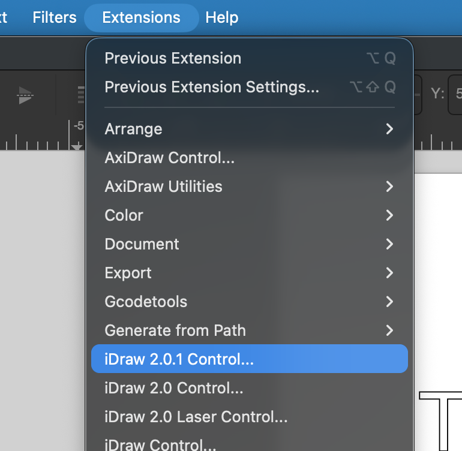
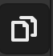
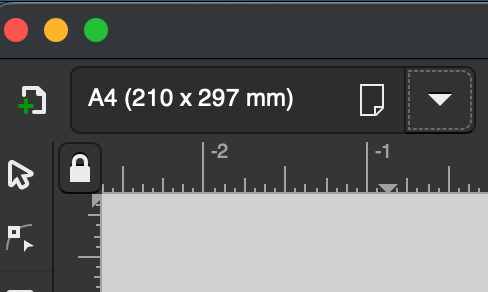
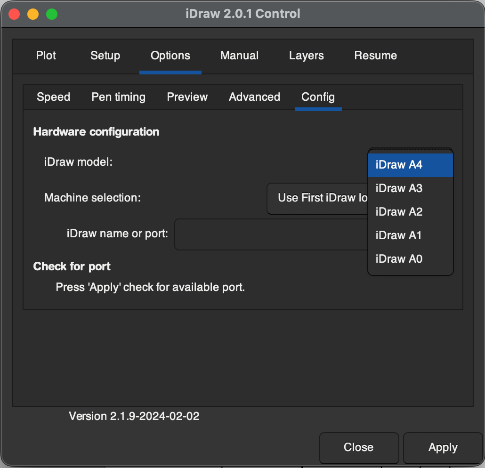
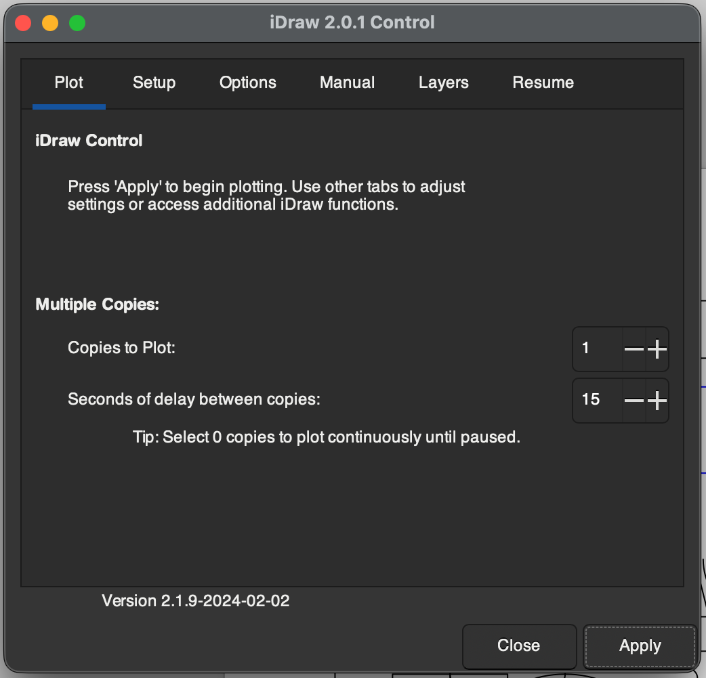

# Instructions for exporting p5.js sketches to SVG for Inkscape Output

While this library is meant for *live* control of pen plotters from p5.js, you may want to export your p5.js sketch as a static SVG file, so it can be plotted using the iDraw Control extension for Inkscape.

---
## Software Installation

If you haven't already installed Inkscape, you can do so [here](https://inkscape.org/release/inkscape-1.4.4/)
To control the plotter with Inkscape, you will need the **iDraw Control** extensions.

1. Download the iDraw software [here](https://drive.google.com/drive/folders/1mDPv3P24jBe4Dkz6jCn9UlGHwQM1bb9V).

2. Follow the [included instructions](https://drive.google.com/file/d/1Sj0N1jeA3QtyrmNQ7zyyeW0Z_B4U5wwB/view) to install the iDraw extensions in the Inkscape extensions folder

3. Once you restart, the iDraw Control extension should be accessible in the Extensions menu:

For a full rundown of the iDraw Control extension, look at [this guide](https://drive.google.com/drive/folders/1mDPv3P24jBe4Dkz6jCn9UlGHwQM1bb9V) (pages 6-25)

---
## Using p5.plotSVG

I recommend using the [p5.plotSVG](https://github.com/golanlevin/p5.plotSvg) library to export p5.js sketches as plottable SVG files for use in Inkscape.

You can download the library from the project repo, which also contains detailed instructions on its use, including some [example sketches](https://github.com/golanlevin/p5.plotSvg/blob/main/examples/README.md).

---

## Exporting SVGs and Plotting

Once you've exported an SVG file using the p5.plotSVG library, it can be opened in Inkscape. Once opened in Inkscape, be sure to set the artboard size to match the plotter's output size (typically A4):

1. Click the "Create and edit document pages" icon in the toolbar:

2. Select your plotter's correct paper size from the dropdown menu:

You may choose to center your graphics on the page after this step. You can do this by selecting all the layers in the  "Layers and Objects" panel, and then clicking and dragging any object to move the selection group.

Before plotting, open the iDraw Control extension from the extensions menu, and navigate to the Options tab. Open the "Config" submenu and, under "iDraw model", select the option that matches your iDraw hardware (typically iDraw A4):

To plot, navigate to the "Plot" tab in the iDraw Control extension, and click "Apply":

You also may choose to change some of the plotter settings, such as the plotting speed, from this extension.